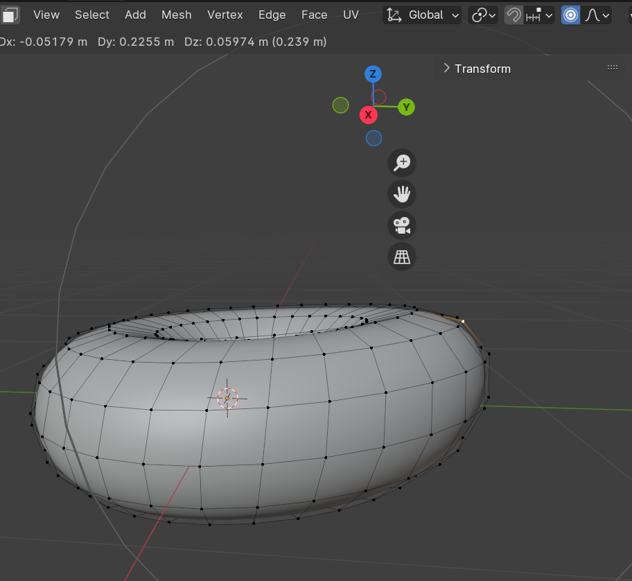
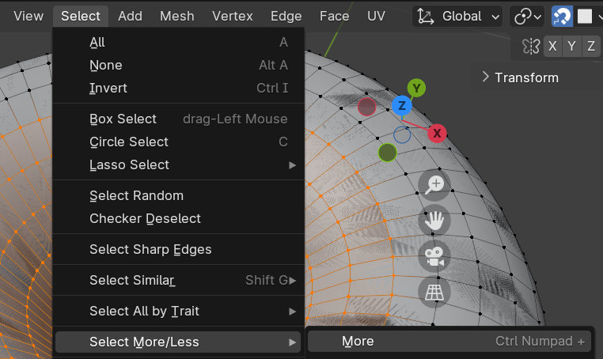

# Useful link
- Keys Cheat Sheet
  http://www.blender.hu/tutor/kdoc/Blender_Cheat_Sheet.
- Textures
  https://www.poliigon.com/textures 

# Keys
- F9
  Open action 
- Tab
  Switch between Object mode <-> Edit mode
- /
  See only selected sections

# Add-ons
- https://andreasaust.gumroad.com/l/drop_it
- https://blendermarket.com/products/sanctus-library-addon---procedural-shaders-collection-for-blender
- https://blendermarket.com/products/realtime-materials-for-blender
- https://blendermarket.com/products/the-plant-library
- https://www.graswald3d.com/gscatter
- https://github.com/shteeve3d/blender-wiggle-2/releases/tag/v2.1.0
- https://gitlab.com/marcopavanello/real-sky
- https://blendermarket.com/products/alt-tab-water
- https://ninodefoq.gumroad.com/l/mossify?layout=profile
- https://blendermarket.com/products/blenrig
- https://n0451.gumroad.com/l/PgyXc
- https://github.com/sketchfab/blender-plugin
## Install Add-Ons
- #1
  
- #2
  
- #3
  
- #4 Refresh, search for it then enable it
  
- #5 Enjoy ~ Right click object -> drop it
  

# Tips
- No need for high resolution:
  - Make it difficult to edit
  - Can smooth it out easily later: Right click  
  - And add modifier to smoth out the edges 
  - Can clearly see the differences on Shade Flat
  
- Can combine Rotating, Moving with X Y Z to make it easier
  
- Proportional Editing: A game changer
  

- Choose all the edges + points all around:
  - 1. Choose a point
  - 2. Press `Alt` while choose the edge
  -  

- Making the icing:
  - 1. Doublicate the donut with Shift+D 
  - 2. Rename them well  
  - 3. Choose the bottom half and Delete -> Verticels
  - 4. Then add modifier Solidify 
  - 

- Use Toggle X-ray to avoid skipping anything
   

- Uncheck in Modifier  if it's hiding our Edit mode

- To keep the icing still sticking to the donut, use `Snap` with `Face Porject` mode
  
  - And also  so that the donut has more squares to make it realistic + can drag it down withoout making the sink in the donut
  

- To avoid theinner part of the icing being dragged too
  - Use choose point then Alt + choose verticel to choose the very bottom part
  - Then `Ctrl`+`+` or  to get the upper part one by one
  - 
  - Then hide it with `H`
  - If wanna unhide it later 

- Making the icing edge go from this  to 
  -   

- Make the drip by choosing 2 points + `E`
  - 
  - 

- Add another modifier `Shrinkwrap` to snap perfectly the icing `remember to put it on top of every modifier`
  
   

- Make the drop of icing fatter:  
  - 1. `Sculpt Mode` with `Inflate` mode
  - 2. Just Left click to apply or Shift + Left Click to do the opposite
  - P/S: The radius should be big enough or wont see it change
  - 3. Apply subdivision modifier with 2 - 2 so that there is enough infos to sculpt
  - 4. Use the `Grab` mode to edit drop details : Make the beginning of the drop thinner, make the icing look more real with gravity
  - 5. To make the upper part kinda fatter: 
    - Use  `Mask` with `Brush-> Front Face Only` on to darken the parts that wont be affected by
      
    - Hit `Ctrl + I` to invert the black mark
      
    - Choose `Mesh Filter` with `Inflate` mode, Strength around 0.1, drag a bit out.
      
    - Smooth it out with `Smooth Mask`
      
    - Smooth again using `Smooth` sculpt
  
- Add new material + color
   

- Make the donut the icing's paaent by hold `Shift` then click icinf first then the donut then `Ctrl+P` -> `Object (Keep Transform)` ---> When we move our donut, the icing will move together (remember to turn off Snap though lol)

- Shading
  - Shift+A to add Image Texture 
  - Remember to choose `Non-color` as `Color Space` for everything other than the original pic
  - 
  - Can do manually like that or add add-on

- Find Auto-Saves UwU
  

- Change the colors in a mesh:
  - Click on `Texture Paint` mode
  - Go to isolate mode with `/` for Donut
  - Change the Base Color to `Image Texture`
   
  - New Image -> Choose the base color and name it
  
  - Choose the newly created image in the Texture Paint Window
  
  - Draw other colors then save the image anywhere 
    

- Add prinkles -> Use Geometry Nodes
  - Click on `New` to begin 
    
  - `Shift + A` to add stuff as usual
     
    `Distributed Point` is to creating point
    `Join Geometry` is to keep the original icing, or else it would be replaced with the points
  - Pin the Geometry Node of icing, then drag&drop a newly created sphere in (aka the `Object Info`)
  - 
     
    
  - To avoid point colappsing each other -> use `Poisson Disk` option for `Distribute Points`
    
  - To avoid having points also on the bottom -> switch to `Weighted Paint` mode
    
    - 1. Add new `Vertex Group` then add a `Named Attribute (attribute)` with it in the `Density` of `Distribute Points`
      
    - 2. Use `Weighted Paint` 
      `Click` to paint
      `Alt + Click` to delete paint
      
      
    - 3. Multiply the value of density (or else we would see no effect of Weighted Paint)
      
    - 4. Apply Scale `Ctrl + A` then choose Scale
      
  - To make the diferent density if doublicate the donuts
    - 1. Drag&Drop `Density Max` onto `Group Input` -> The field would appear in `Modify` tab on every duplicated donuts
      
    - 2. Modify its value each time
      
      
- We can define unit of mesurement and resize the donuts to the correct size
  
  Then choose scaled ones then `Shift + A` -> choose Scale to apply 

      