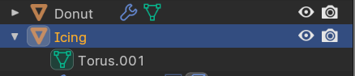
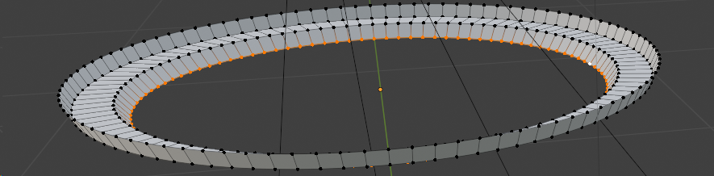
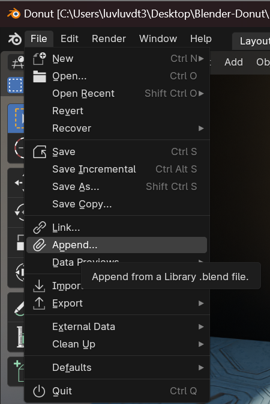
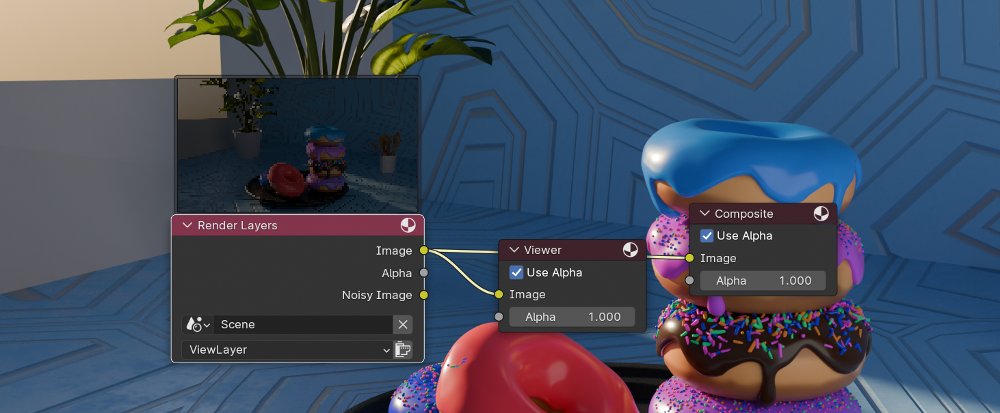

# Useful link
- Keys Cheat Sheet
  http://www.blender.hu/tutor/kdoc/Blender_Cheat_Sheet.
- Textures
  https://www.poliigon.com/textures 

# Keys
- F9
  Open action 
- Tab
  Switch between Object mode <-> Edit mode
- /
  See only selected sections

# Add-ons
- https://andreasaust.gumroad.com/l/drop_it
- https://blendermarket.com/products/sanctus-library-addon---procedural-shaders-collection-for-blender
- https://blendermarket.com/products/realtime-materials-for-blender
- https://blendermarket.com/products/the-plant-library
- https://www.graswald3d.com/gscatter
- https://github.com/shteeve3d/blender-wiggle-2/releases/tag/v2.1.0
- https://gitlab.com/marcopavanello/real-sky
- https://blendermarket.com/products/alt-tab-water
- https://ninodefoq.gumroad.com/l/mossify?layout=profile
- https://blendermarket.com/products/blenrig
- https://n0451.gumroad.com/l/PgyXc
- https://github.com/sketchfab/blender-plugin
- https://www.vfxmed.com/2023/07/blender-3-2-cloudscapes-v2-pro-2023-update-crack-download/
- https://www.vfxmed.com/2023/06/blender-2-7-auto-rig-pro-v-3-68-24-free-2023-download/
  
## Install Add-Ons
- #1
  
- #2
  
- #3
  
- #4 Refresh, search for it then enable it
  
- #5 Enjoy ~ Right click object -> drop it
  

# Tips
- No need for high resolution:
  - Make it difficult to edit
  - Can smooth it out easily later: Right click  
  - And add modifier to smoth out the edges 
  - Can clearly see the differences on Shade Flat
  
- Can combine Rotating, Moving with X Y Z to make it easier
  
- Proportional Editing: A game changer
  

- Choose all the edges + points all around:
  - 1. Choose a point
  - 2. Press `Alt` while choose the edge
  -  

- Making the icing:
  - 1. Doublicate the donut with Shift+D 
  - 2. Rename them well  
  - 3. Choose the bottom half and Delete -> Verticels
  - 4. Then add modifier Solidify 
  - 

- Use Toggle X-ray to avoid skipping anything
   

- Uncheck in Modifier  if it's hiding our Edit mode

- To keep the icing still sticking to the donut, use `Snap` with `Face Porject` mode
  
  - And also  so that the donut has more squares to make it realistic + can drag it down withoout making the sink in the donut
  

- To avoid theinner part of the icing being dragged too
  - Use choose point then Alt + choose verticel to choose the very bottom part
  - Then `Ctrl`+`+` or  to get the upper part one by one
  - 
  - Then hide it with `H`
  - If wanna unhide it later 

- Making the icing edge go from this  to 
  -   

- Make the drip by choosing 2 points + `E`
  - 
  - 

- Add another modifier `Shrinkwrap` to snap perfectly the icing `remember to put it on top of every modifier`
  
   

- Make the drop of icing fatter:  
  - 1. `Sculpt Mode` with `Inflate` mode
  - 2. Just Left click to apply or Shift + Left Click to do the opposite
  - P/S: The radius should be big enough or wont see it change
  - 3. Apply subdivision modifier with 2 - 2 so that there is enough infos to sculpt
  - 4. Use the `Grab` mode to edit drop details : Make the beginning of the drop thinner, make the icing look more real with gravity
  - 5. To make the upper part kinda fatter: 
    - Use  `Mask` with `Brush-> Front Face Only` on to darken the parts that wont be affected by
      
    - Hit `Ctrl + I` to invert the black mark
      
    - Choose `Mesh Filter` with `Inflate` mode, Strength around 0.1, drag a bit out.
      
    - Smooth it out with `Smooth Mask`
      
    - Smooth again using `Smooth` sculpt
  
- Add new material + color
   

- Make the donut the icing's paaent by hold `Shift` then click icinf first then the donut then `Ctrl+P` -> `Object (Keep Transform)` ---> When we move our donut, the icing will move together (remember to turn off Snap though lol)

- Shading
  - Shift+A to add Image Texture 
  - Remember to choose `Non-color` as `Color Space` for everything other than the original pic
  - 
  - Can do manually like that or add add-on

- Find Auto-Saves UwU
  

- Change the colors in a mesh:
  - Click on `Texture Paint` mode
  - Go to isolate mode with `/` for Donut
  - Change the Base Color to `Image Texture`
   
  - New Image -> Choose the base color and name it
  
  - Choose the newly created image in the Texture Paint Window
  
  - Draw other colors then save the image anywhere 
    

- Add prinkles -> Use Geometry Nodes
  - Click on `New` to begin 
    
  - `Shift + A` to add stuff as usual
     
    `Distributed Point` is to creating point
    `Join Geometry` is to keep the original icing, or else it would be replaced with the points
  - Pin the Geometry Node of icing, then drag&drop a newly created sphere in (aka the `Object Info`)
  - 
     
    
  - To avoid point colappsing each other -> use `Poisson Disk` option for `Distribute Points`
    
  - To avoid having points also on the bottom -> switch to `Weighted Paint` mode
    
    - 1. Add new `Vertex Group` then add a `Named Attribute (attribute)` with it in the `Density` of `Distribute Points`
      
    - 2. Use `Weighted Paint` 
      `Click` to paint
      `Alt + Click` to delete paint
      
      
    - 3. Multiply the value of density (or else we would see no effect of Weighted Paint)
      
    - 4. Apply Scale `Ctrl + A` then choose Scale
      
  - To make the diferent density if doublicate the donuts
    - 1. Drag&Drop `Density Max` onto `Group Input` -> The field would appear in `Modify` tab on every duplicated donuts
      
    - 2. Modify its value each time
      
      
- We can define unit of mesurement and resize the donuts to the correct size
  
  Then choose scaled ones then `Shift + A` -> choose Scale to apply 

- Adding long sprinkles
  - `Shift + A` add cylinder 
  - 
  - To make the rounded edge:
    - 1. Go to `Edit mode` then choose the top and bottom rounds
    - 2. `Ctrl+B` then stretch out
    - 3. Add more layers to that when scroll up 
     
  - Make other spinkles:
    - 1. `Shift D` to doublicate
    - 2. Choose the top part `G` then `Z` to lengthen it up (remember to turn off the Proportional Editing)
      
  - Make spinkles bend
    - 1. Edit mode then `Ctrl + R` to create the inner circle then scroll to create some more
      
    - 2. Then add modifier `Simple Deform`
      
      
      - If doesnt work
        - `Ctrl + A` -> All transforms
        - Right click -> Set Origin -> Origin to Geometry 
    - 3. Apply it
- Apply different sprinkles
  - Doublicate the donut
  - Click on the button `2` there so that the variables are separated for each donut
     
  - Drag&Drop the collection of different spinkles into Geometry Node and check the 3 checkboxes
    
    
  - Also connect the Rotation of the 2 greens class so that the sprinkles can rotates based on the object's surface
  - Adding Rotate Euler
    
  - Also rotates the prinkles to 90 degree
  - To ajust size of the spinkles:
    
  - To randomize the rotation of the sprinkles while keeping them reasonable
    

- Make sprinkles colorful and randomized colors 
  - Apply the same material for many objects
    - Create a new material within a sprinkle
    - Then `Shift` choosing every sprinkles with the target spinkles last with yellow outline
    - Then `Ctrl + L` choose
       
  - Go to Shadow
    - Create `Shift + A` a `Object info` and connect it with `Base Color`
       
    - Adding the `Color Ramp` in between to get randomized colors
      
    - Make certain colors have metalic:
      - `Ctrl + Shift + D` to doublicate but still keep the connection of Color Ramp
      - For the one with metalic property, make it white, the normal ones black
       
        
       
      - `Ctrl+Shift+D` then connect to Rougness for some shinniness
      

- Rendering:
  - Click the icon  to see the camera viewport
  - ` Shift + ` ` to move the camera with WASD
  - Improve rendering quality
    -  
    - 
    - Switch to GPU for faster render & Choose `Cycle` for better quality but longer render
      
      
    - Also with `Denoise` checked
      

- Improve the material of the icing for better feeling? idk

- Also with the icing
  

- Adding a plate :
  - Can split screen with
     
    
  - `Shift + A` create a new `Round`
  - Then with `E` and `S` to create each layer together with Proportional Editing
  - To create the face surface at the bottom, choose the bottom round and hit `F`
    
    
  - Switch to `Edge` mode to select the round edges without choosing also the connection parts with `Alt + Shift`
    
  - Then `Ctrl + B`
    
  - Thicken it with `Solidify` modifier then apply
    
  - Then choose the 2 outer edges
    
  - `Ctrl + B`then `C`to avoid overlap
    
  - `A` to choose everything then
    
- Can make the camera smaller too edit easier
  

- Different icings:
  - Rename each then click the number next to each to separate from others
  
  

- Adding skylight
  - Choose `Sky Texture` as color is `World` section
    
  - Can modify the light explosure in `Render` section
     
  - Can also modify the sun's time and rotation
    
- Create the counter
  - Create a new cube and go to   `Wildframe` mode
  -  Then `G` then `B`
  -  Choose the corner
    
  - Then drag it to the corner that we want it to be aligned wiht
    
  - Got to `Edit` mode with `Face` mode
  - Choose a face then hit `G` then `B` to make the cube perfectly cover everything
  

- Make window
  - Choose a face
  - Hit `I` the drag it in a bit
   
  - Then delate that small part
    
  - Rotate the whole stuff well for the best sun lighting
    
  
- Walls
  - Create materials
  - Choose the wall behind then `Assign` it to the black-colored material to control lighting
    
  - But can also add `Light->Aria` instead
  
- Download Models
  - Download & unzip it
    
  - Click `File->Append` (remember to be in Object Mode, or else it wont work)
       
  - 
  - Tadahh 
    
  - Add also Poligon's addon stuff
    

- Compose
  - Check `Use Node`
    
  - Hit `F12` or `Render` button to render
  - Then `Ctrl + Shift + click` on `Render Layer` to create `Viewer` node + image
    
  - Can modify colors with `Shift + A` -> Color -> Ajust -> Color Balance
    
  - Can also do it here (more recommended)
    
  - Adding shiny glares
    - 
    - 
  - Make the glare foggier
    -  
    -  
  -  Edit the `Fac`, which control the second Image aka the second Glare
     
  - Final step (doesnt change any effect but kinda avoid errors in the future?)
    
  - Apply it to `Always`
    
  - If wanna render without `Compose`'s effects -> Uncheck `Compositing`
    

- Camera animation
  - Add an empty axe
    
  - Choose `Sphere` as display
    
  - `Ctrl + P` set sphere as parent
    
  - Click on end frame -> Choose the empty sphere -> Hit `I` - Rotation
    
  - So the last frame would be our original Render
  - Go to the frist frame and edit the rotation and location
    
    
  - Go to `Animation` mode and choose `Graph Editor`
    
  - We are gonna edit mostly X & Y Rotation
    
    
    With `R` and `G` to these black points
  - Fast at the start and slower a the ending 
    
  - To zoom in at the start -> Scale down the Sphere
    - `I` then
      
    - Then `S` make it smaller
      

- Rendering
  - Kinda put it to 400 to make rendering faster
    
    
  - Hide sprinkles from camera
    
  - Set camera's focus
    
  - Active Motion Blur
    
  - 
  - Now we wait
    